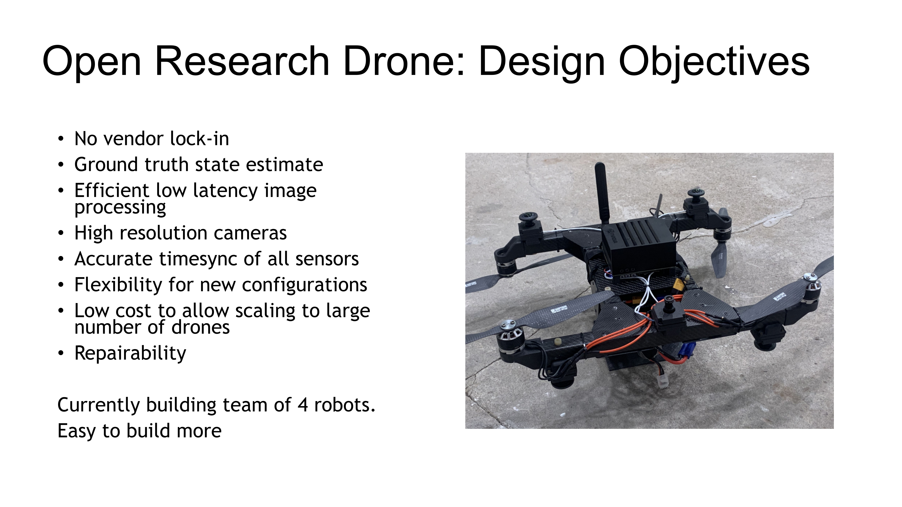

Introduction
============

Several commercial drones exist, but up until now, none existed that were fully open for research.

The Open Research Drone aims to create an easy-to-build, fully open source UAV platform for academic research.

